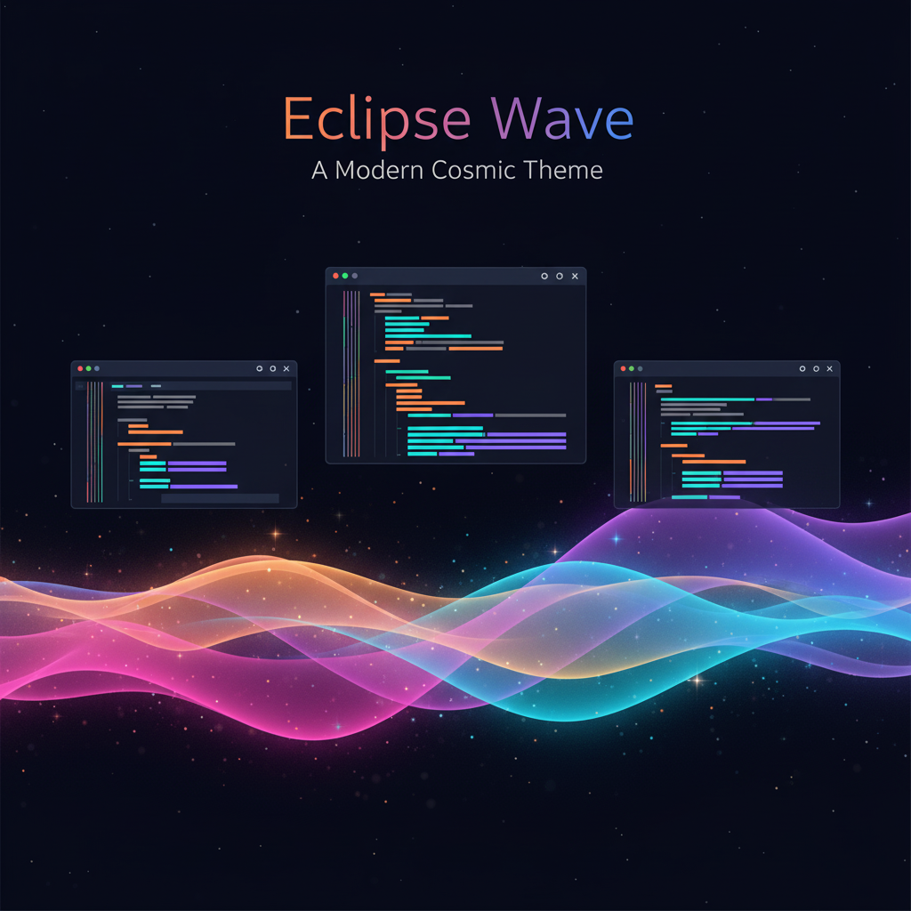

  

# 🌊 Eclipse Wave

Eclipse Wave is a modern, minimal, and elegant theme designed for developers who love a clean coding experience.
Crafted with simplicity and readability in mind, Eclipse Wave enhances your workflow by giving your editor a fresh, sleek, and distraction-free look.

---

## ✨ Features

- 🎨 **Modern Color Palette** – Balanced colors for dark backgrounds.
- 👓 **Readable Syntax Highlighting** – Designed for long coding sessions without eye strain.
- ⚡ **Minimal & Clean** – No unnecessary clutter, just focus on your code.
- 🛠️ **Multi-language Support** – Works across popular languages (JavaScript, Python, C++, Java, etc.).

---

## 🚀 Installation

### For **VS Code**

1. Open **Extensions** sidebar in VS Code.
2. Search for **Eclipse Wave**.
3. Click **Install**.
4. Press `Ctrl+K Ctrl+T` and select **Eclipse Wave** from the list.

---

## ⚙️ Usage

- Toggle theme:
  - Open Command Palette (`Ctrl+Shift+P` or `Cmd+Shift+P` on Mac).
  - Type `Color Theme`.
  - Select **Eclipse Wave**.

---

## 🛠️ Contribution

Contributions are welcome! 🎉
If you’d like to improve Eclipse Wave:

1. Fork the repo
2. Create a new branch (`git checkout -b feature-new`)
3. Commit your changes (`git commit -m 'Add new feature'`)
4. Push to the branch (`git push origin feature-new`)
5. Open a Pull Request

---

## 📜 License

Eclipse Wave is released under the **MIT License** – free to use, modify, and share.

---

## 👤 Author

Built with ❤️ by **Arin Mandal**

- GitHub: [@arinmandal](https://github.com/arinmandal)
