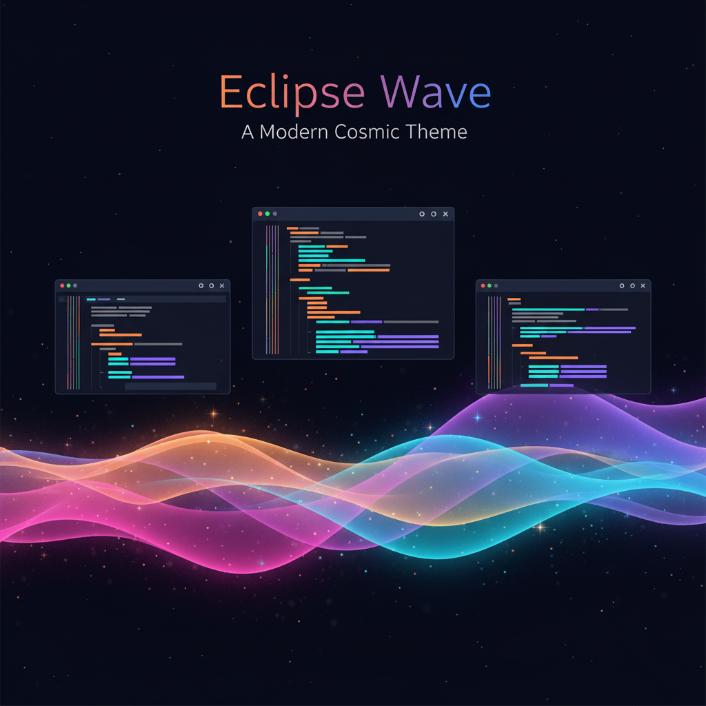

<p align="center">
  
</p>

<h1 align="center">🌊 Eclipse Wave</h1>

<p align="center">
  <strong>A cosmic theme collection — four variants — built for long coding sessions, late nights, and everything in between.</strong>
</p>

---

Eclipse Wave started as a single dark theme and grew into a full family. Every variant shares the same cosmic DNA — space-inspired syntax colors, careful contrast, and attention to the parts of VS Code most themes ignore. Pick the one that matches your environment and your hours.

> **Four variants:** `Eclipse Wave` · `Eclipse Wave Light` · `Eclipse Wave Midnight` · `Eclipse Wave Storm`

## 🎯 Color Palettes

### 🌑 Eclipse Wave (Dark)

| Color              | Hex       | Usage                                     |
| ------------------ | --------- | ----------------------------------------- |
| 🟣 Galactic Purple | `#9D7CFF` | Keywords, control flow, active tab accent |
| 🔵 Star Blue       | `#82AAFF` | Functions, methods, JSON keys             |
| 🟢 Aurora Green    | `#A1C682` | Strings, inline code                      |
| 🟠 Warm Amber      | `#E5A574` | Variables, numbers                        |
| 🟡 Cosmic Gold     | `#D7BA7D` | Classes, types, parameters                |
| 🩵 Nebula Cyan     | `#7CC8DE` | Type annotations, DOM, interfaces         |
| 🩷 Pink Starlight  | `#FF79C6` | Attributes, regex, namespaces             |
| 🪻 Lavender        | `#C792EA` | Operators, decorators, enums              |
| 🔴 Aurora Rose     | `#E17888` | HTML tags                                 |
| ⭐ Golden Star     | `#FFD166` | React components, modules                 |

> Background: `#0B0F1A` · Foreground: `#C0CBE3`

### 🌤️ Eclipse Wave Light

| Color              | Hex       | Usage                                     |
| ------------------ | --------- | ----------------------------------------- |
| 🟣 Cosmic Violet   | `#7A5FD0` | Keywords, control flow, active tab accent |
| 🔵 Deep Star Blue  | `#2E5FA8` | Functions, methods, JSON keys             |
| 🟢 Deep Aurora     | `#3A7A50` | Strings, inline code                      |
| 🟠 Earthy Amber    | `#B05E20` | Variables, numbers                        |
| 🟡 Earthy Gold     | `#87642A` | Classes, types, parameters                |
| 🩵 Deep Teal       | `#277A82` | Type annotations, DOM, interfaces         |
| 🩷 Nebula Pink     | `#A0336B` | Attributes, regex, namespaces             |
| 🪻 Muted Lavender  | `#8065C0` | Operators, decorators, enums              |
| 🔴 Deep Rose       | `#A83050` | HTML tags                                 |
| ⭐ Deep Gold       | `#8B6400` | React components, modules                 |

> Background: `#F5F4F9` · Foreground: `#2B2D42`

### 🌑 Eclipse Wave Midnight

| Color | Hex | Usage |
| --- | --- | --- |
| 🟣 Twilight Violet | `#8B6EF0` | Keywords, accent, active tab |
| 🔵 Starlight Blue | `#7BA8F5` | Functions, methods |
| 🟢 Nebula Leaf | `#8DC76E` | Strings, inline code |
| 🟠 Ember | `#D4906A` | Variables, numbers |
| 🟡 Stardust Gold | `#C4A268` | Classes, types |
| 🩵 Deep Cyan | `#68B8CC` | Properties, DOM, interfaces |
| 🩷 Soft Magenta | `#D860A8` | Attributes, regex |
| 🪻 Deep Lavender | `#B880D5` | Operators, decorators |

> Background: `#07090F` (near-void black) · Foreground: `#B0BCE0`  
> *Designed for OLED displays and late-night sessions — reduced brightness, warmer tones.*

### ⛈️ Eclipse Wave Storm

| Color | Hex | Usage |
| --- | --- | --- |
| 🔵 Lightning Blue | `#7485E8` | Keywords, accent, active tab |
| 🌊 Rain Blue | `#68A8E0` | Functions, methods |
| 🟢 Seafoam | `#6DB585` | Strings, inline code |
| 🟠 Amber Lightning | `#D08858` | Variables, numbers |
| 🟡 Storm Gold | `#B89A60` | Classes, types |
| 🩵 Storm Cyan | `#5AAAC0` | Properties, DOM, interfaces |
| 🩷 Storm Pink | `#C060A0` | Attributes, regex |
| 🪻 Purple Storm | `#9080C8` | Operators, decorators |

> Background: `#0A1020` (dark storm blue) · Foreground: `#B4C4DC`  
> *Cool, desaturated palette — easier on the eyes than the main dark theme without going full black.*

---

## ✨ Features

- 🌌 **Four Variants** — Dark, Light, Midnight (OLED), and Storm (blue-gray) in one extension
- 🎨 **Cosmic Color Palette** — Space-inspired accents consistent across all variants
- 👓 **Eye Comfort First** — Softened tones designed for 4-8+ hour sessions; Midnight especially built for late nights
- ⚡ **Semantic Highlighting** — Full semantic token coverage for TypeScript, Rust, Python, and more — including `*.mutable`, `*.async`, `*.deprecated` modifiers
- 🌐 **Multi-language** — JS, TS, Python, React, Go, Rust, Java, C#, SCSS, GraphQL, HTML, Markdown, SQL, Shell, TOML, Docker & more
- 🎯 **Complete IntelliSense Icons** — All 35 `symbolIcon.*` colors themed (the autocomplete icon colors most themes leave as defaults)
- 🖥️ **Full 16-color Terminal** — All ANSI standard + bright variants covered; `git log`, `jest`, `npm` output looks right
- 🤖 **AI-Ready** — Ghost text styling for Copilot suggestions
- 🔗 **305+ UI Color Keys** — Tabs, sidebar, terminal, debug, charts, command center, notebooks, diff editor — everything
- 🧩 **Bracket Pair Colorization** — Six distinct colors per bracket level

---

## 🚀 Installation

1. Open **Extensions** sidebar in VS Code (`Ctrl+Shift+X`)
2. Search for **Eclipse Wave**
3. Click **Install**
4. Press `Ctrl+K Ctrl+T` and select a variant:
   - **Eclipse Wave** — deep cosmic dark, the original
   - **Eclipse Wave Light** — soft nebula light for daytime
   - **Eclipse Wave Midnight** — near-black OLED, warm palette for late nights
   - **Eclipse Wave Storm** — dark blue-gray, cool and desaturated

---

## ⚙️ Recommended Settings

For the best experience, add these to your `settings.json`:

```json
{
  "editor.fontFamily": "'JetBrains Mono', 'Fira Code', Consolas, monospace",
  "editor.fontSize": 14,
  "editor.fontLigatures": true,
  "editor.cursorBlinking": "smooth",
  "editor.cursorSmoothCaretAnimation": "on",
  "editor.smoothScrolling": true,
  "editor.bracketPairColorization.enabled": true,
  "editor.guides.bracketPairs": "active",
  "workbench.colorTheme": "Eclipse Wave"
}
```

---

## 🛠️ Contribution

Contributions are welcome! 🎉
If you'd like to improve Eclipse Wave:

1. Fork the repo
2. Create a new branch (`git checkout -b feature-new`)
3. Commit your changes (`git commit -m 'Add new feature'`)
4. Push to the branch (`git push origin feature-new`)
5. Open a Pull Request

---

## 📜 License

[](LICENSE)

Eclipse Wave is released under the **MIT License** — free to use, modify, and share.

---

## 👤 Author

Built with ❤️ by **Arin Mandal**

- GitHub: [@arinmandal](https://github.com/arinmandal)
