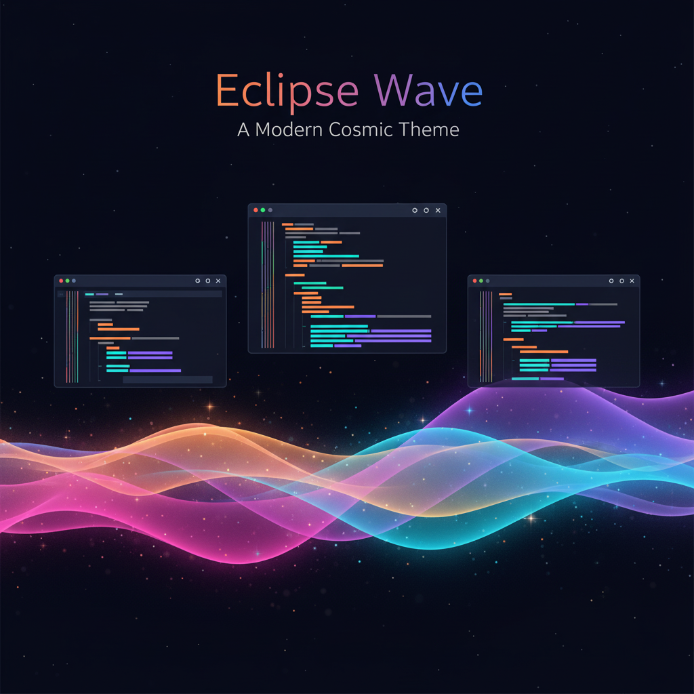
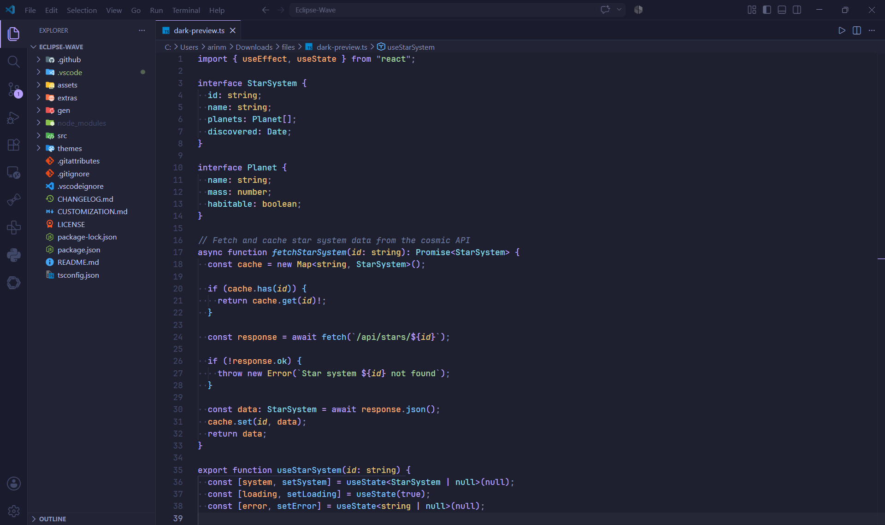
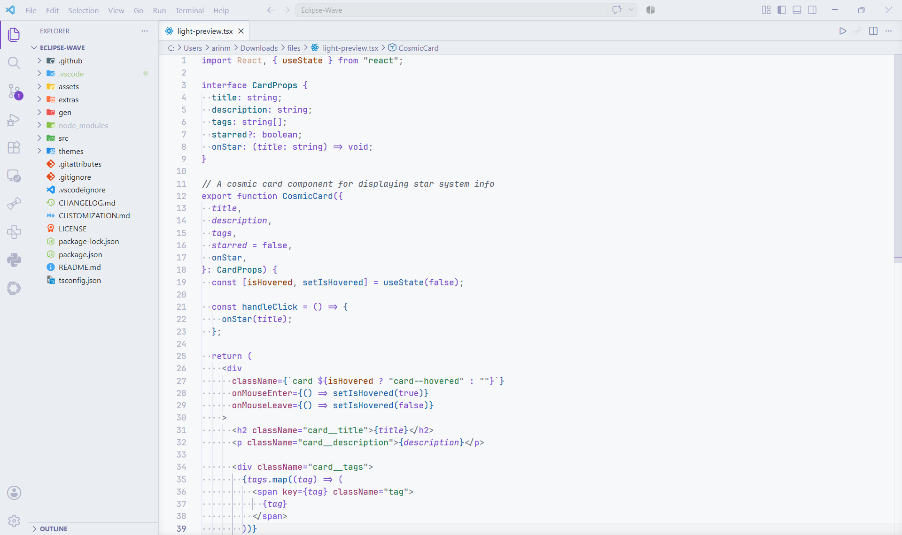
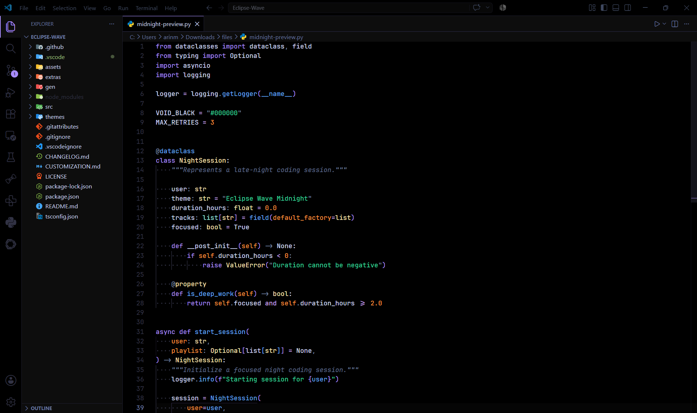
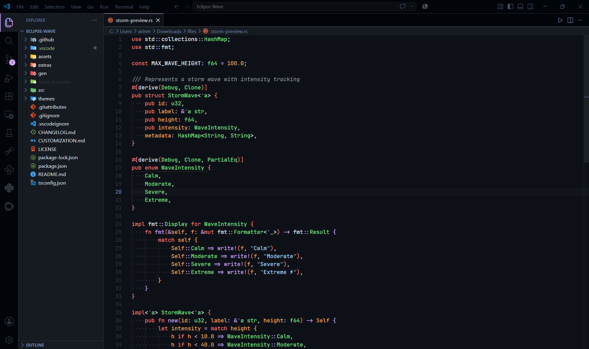

<p align="center">
  
</p>

<h1 align="center">🌊 Eclipse Wave</h1>

<p align="center">
  <strong>A cosmic theme collection — four variants — built for long coding sessions, late nights, and everything in between.</strong>
</p>

<p align="center">
  <a href="https://marketplace.visualstudio.com/items?itemName=ArinMandal.eclipse-wave">
    
  </a>
  <a href="https://marketplace.visualstudio.com/items?itemName=ArinMandal.eclipse-wave">
    
  </a>
  <a href="https://marketplace.visualstudio.com/items?itemName=ArinMandal.eclipse-wave">
    
  </a>
  <a href="LICENSE">
    
  </a>
</p>

---

Eclipse Wave started as a single dark theme and grew into a full family. Every variant shares the same cosmic DNA — space-inspired syntax colors, careful contrast, and attention to the parts of VS Code most themes ignore. Pick the one that matches your environment and your hours.

---

## 🌑 Eclipse Wave — Dark

> TypeScript · deep cosmic dark · the original

<p align="center">
  
</p>

The original Eclipse Wave. Blue-tinted dark background with a violet-to-sky-blue keyword/function split, warm amber variables, and soft muted comments that stay readable without competing for attention.

---

## ☀️ Eclipse Wave — Light

> React JSX · soft nebula white · built for daylight

<p align="center">
  
</p>

Eclipse Wave's daytime companion. An off-white background that removes the glare of pure white, with every accent color deepened and desaturated for high contrast readability without losing the cosmic feel.

---

## 🌚 Eclipse Wave — Midnight

> Python · true OLED black · late-night sessions

<p align="center">
  
</p>

Built for OLED displays and 2am coding. True black background with vivid, saturated accents — emerald strings, warm orange variables, violet keywords — colors that hold their own on pure black without turning neon.

---

## ⛈️ Eclipse Wave — Storm

> Rust · deep blue-black · cool and bold

<p align="center">
  
</p>

A cool blue-black canvas with strong color separation. Red-orange keywords, purple functions, light-blue strings — each token role is unmistakably distinct. Built for when you want drama without darkness.

---

## ✨ Features

- 🌌 **Four Variants** — Dark, Light, Midnight (OLED), and Storm in one extension
- 🎨 **Cosmic Color Palette** — Space-inspired accents, WCAG AA contrast verified on every build
- 👓 **Eye Comfort First** — Softened tones for 4-8+ hour sessions; Midnight built specifically for late nights and OLED
- ⚡ **Semantic Highlighting** — Full semantic token coverage for TypeScript, Rust, Python and more — including `*.mutable`, `*.async`, `*.deprecated` modifiers
- 🌐 **Multi-language** — JS, TS, Python, React, Go, Rust, Java, C#, SCSS, GraphQL, HTML, Markdown, SQL, Shell, TOML, Docker & more
- 🎯 **Complete IntelliSense Icons** — All 35 `symbolIcon.*` colors themed (the autocomplete icons most themes leave as defaults)
- 🖥️ **Full 16-color Terminal** — All ANSI standard + bright variants covered; `git log`, `jest`, `npm` output looks correct
- 🤖 **AI-Ready** — Ghost text styling for Copilot and inline suggestions
- 🔗 **305+ UI Color Keys** — Tabs, sidebar, terminal, debug, charts, command center, notebooks, diff editor — everything
- 🧩 **Bracket Pair Colorization** — Six distinct colors per bracket level

---

## 🚀 Installation

1. Open **Extensions** sidebar in VS Code (`Ctrl+Shift+X`)
2. Search for **Eclipse Wave**
3. Click **Install**
4. Press `Ctrl+K Ctrl+T` and select your variant:
   - **Eclipse Wave** — deep cosmic dark, the original
   - **Eclipse Wave Light** — soft nebula white for daytime
   - **Eclipse Wave Midnight** — true OLED black, vivid palette for late nights
   - **Eclipse Wave Storm** — deep blue-black, bold and cool

---

## ⚙️ Recommended Settings

```json
{
  "editor.fontFamily": "'JetBrains Mono', 'Fira Code', Consolas, monospace",
  "editor.fontSize": 14,
  "editor.fontLigatures": true,
  "editor.cursorBlinking": "smooth",
  "editor.cursorSmoothCaretAnimation": "on",
  "editor.smoothScrolling": true,
  "editor.bracketPairColorization.enabled": true,
  "editor.guides.bracketPairs": "active",
  "workbench.colorTheme": "Eclipse Wave"
}
```
---

## 🛠️ Contribution

Contributions are welcome! 🎉

1. Fork the repo
2. Create a new branch (`git checkout -b feature-new`)
3. Commit your changes (`git commit -m 'Add new feature'`)
4. Push to the branch (`git push origin feature-new`)
5. Open a Pull Request

---

## 📜 License

[](LICENSE)

Eclipse Wave is released under the **MIT License** — free to use, modify, and share.

---

## 👤 Author

Built with ❤️ by **Arin Mandal**

- GitHub: [@arinmandal](https://github.com/arinmandal)
